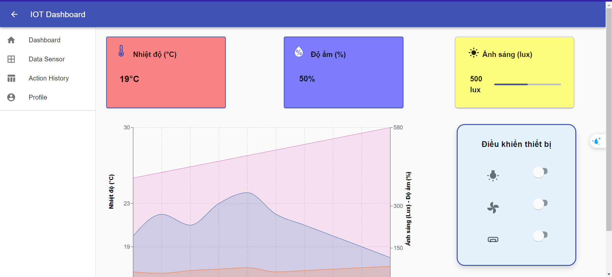

Đây là một dashboard IoT được xây dựng bằng React và sử dụng Material-UI, cho phép theo dõi nhiệt độ, độ ẩm, ánh sáng trong phòng và điều khiển các thiết bị trong phòng đó.

# [Live](https://matarial-ui-react-dashboard.netlify.app/)

